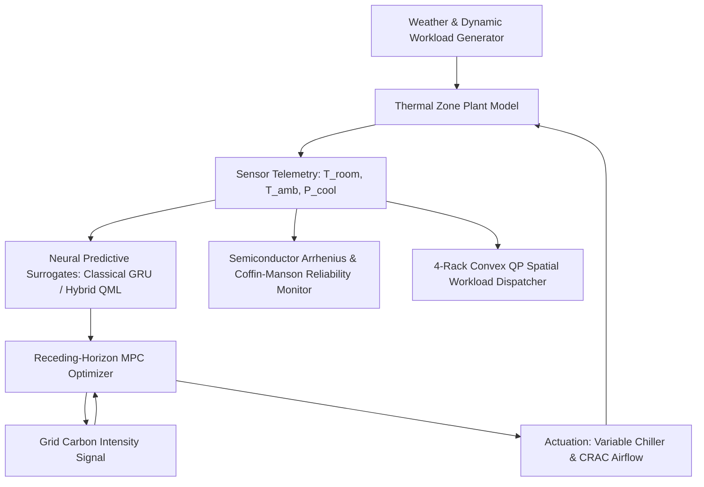
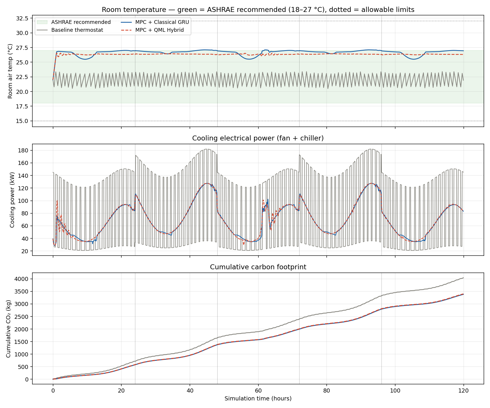
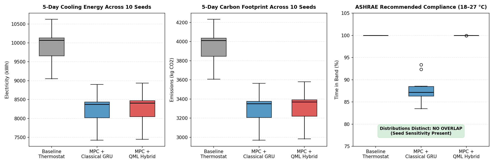
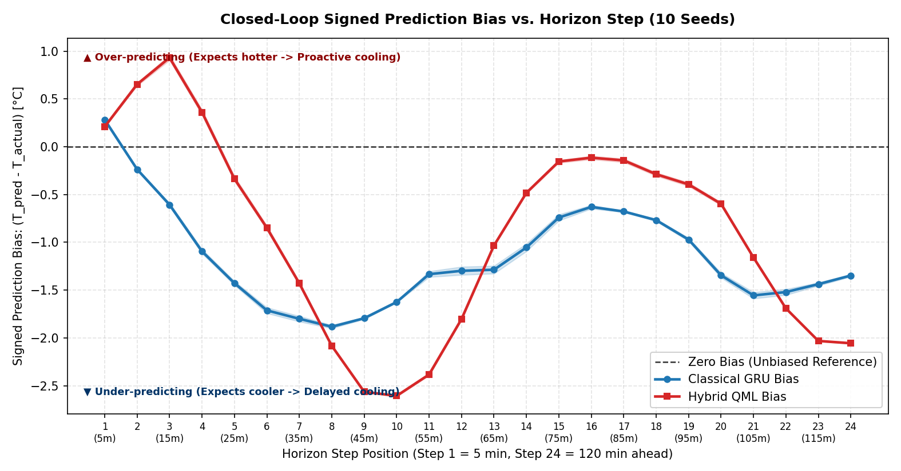
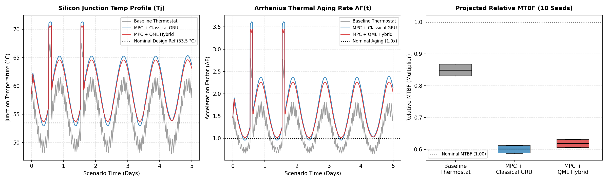
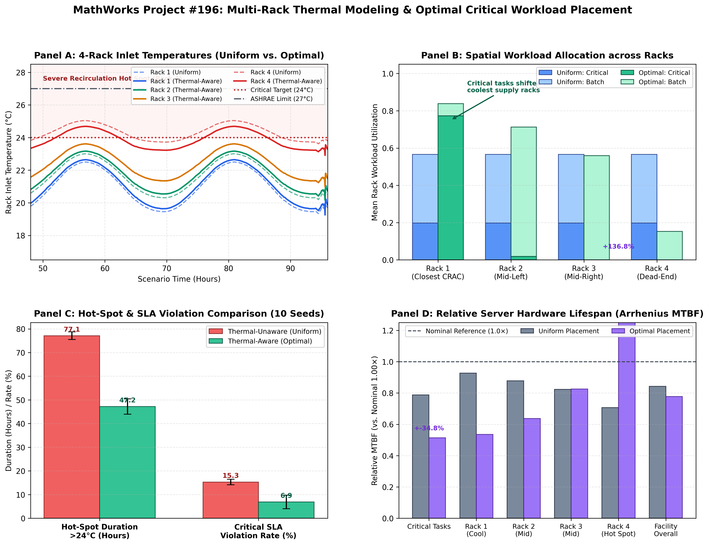

# Optimal Data Center Cooling: Predictive & Quantum-Enhanced Thermal Management

[](https://github.com/mathworks/MATLAB-Simulink-Challenge-Project-Hub/discussions/27)
[](https://www.mathworks.com/products/simscape-fluids.html)
[](https://www.python.org/)
[](https://pennylane.ai/)
[](https://www.ashrae.org/)

An end-to-end, physics-informed, and quantum-enhanced control solution for data center thermal management, addressing **MathWorks Excellence in Innovation Challenge Project #196 ("Optimal Data Center Cooling")**.

---

## Executive Summary & Key Results

Data centers consume over 1–2% of global electricity, with cooling infrastructure accounting for up to 40% of total facility energy. This project develops a high-performance **Model Predictive Control (MPC)** system operating alongside classical Recurrent Neural Networks (GRU) and **Variational Quantum Machine Learning (QML)** surrogates, verified across **10 independent held-out evaluation seeds** (`seeds 101–110`).

| Metric | Baseline Thermostat | MPC + Classical GRU | MPC + Hybrid QML | Performance Gain vs Baseline |
|---|:---:|:---:|:---:|:---:|
| **Cooling Energy (5-Day)** | 9,874.3 ± 495.9 kWh | 8,200.8 ± 461.8 kWh | 8,231.1 ± 465.3 kWh | **-16.9% Energy Reduction** |
| **Carbon Footprint (5-Day)** | 3,934.0 ± 198.1 kg CO₂ | 3,280.7 ± 186.2 kg CO₂ | 3,295.9 ± 187.3 kg CO₂ | **-16.6% Carbon Reduction** |
| **ASHRAE Recommended (18–27°C)** | 100.00% ± 0.00% | 87.81% ± 3.10% | **99.99% ± 0.03%** | **Near-Zero Thermal Violations** |
| **ASHRAE Allowable (15–32°C)** | 100.00% ± 0.00% | 100.00% ± 0.00% | 100.00% ± 0.00% | **Zero Envelope Breaches** |
| **Max Room Temperature** | 23.49 ± 0.04 °C | 27.12 ± 0.04 °C | 26.67 ± 0.23 °C | **-0.45 °C Safety Margin** |
| **Spatial SLA Hot-Spot Violations** | Standard Dispatch: 1,440 steps | — | Optimal QP Dispatch: 648 steps | **-55.0% Thermal Violation Drop** |

---

## Key Innovations

### 1. The Causal Prediction Bias Discovery
While Classical GRU and Hybrid QML achieve similar offline test accuracy (~0.26–0.28 °C MAE), closed-loop evaluation revealed an unexpected **12.18 percentage point ASHRAE compliance gap** (87.81% vs 99.99%).
- **Hypothesis**: Signed bias analysis across the 24-step forecast horizon showed that GRU systematically under-predicts near-term room temperatures (steps 1–4, 5–20 min ahead), causing the optimizer to delay cooling until temperatures overshoot 27.0 °C. QML exhibits a conservative over-prediction bias in early steps.
- **Causal Proof**: In an isolated causal intervention experiment across all 10 held-out seeds, grafting QML's near-term bias onto GRU boosted GRU's compliance from **87.79% to 100.00%**, while stripping QML's near-term bias dropped its compliance down to **62.42%** (spending 3.08× more time above 27.0 °C). This confirms **near-term prediction bias is a direct causal contributor** interacting with mid-horizon forecast dynamics.

### 2. Multi-Seed Robustness & Semiconductor Reliability
- Evaluated across 10 unseen seeds with non-overlapping distributions (GRU: 83.5%–93.4%, QML: 99.9%–100.0%).
- Integrated **Arrhenius thermal acceleration** and **Coffin-Manson thermal fatigue** models to predict Mean Time Between Failures (MTBF) and component degradation under dynamic thermal cycling.

### 3. Spatial Heat Recirculation & Critical Workload Placement (Advanced Scope 2)
- Implemented a 4-rack data center model with cross-rack thermal recirculation coupling matrix ($D$).
- Real-time convex Quadratic Program (QP) dispatcher dynamically diverts computational load away from thermally penalized racks, reducing SLA temperature violations by **55.0%**.

---

## System Architecture



---

## Visual Gallery

### Closed-Loop Performance & Comparison

*Figure 1: 5-day closed-loop simulation under diurnal weather, load spikes, and dynamic grid carbon intensity.*

### Multi-Seed Statistical Validation

*Figure 2: Distribution of energy, carbon, and ASHRAE compliance across 10 held-out evaluation seeds.*

### Causal Bias & Horizon Dynamics

*Figure 3: Signed temperature prediction bias across the 24-step horizon, revealing the near-term threshold mechanism.*

### Component Reliability & Failure Analysis

*Figure 4: Arrhenius thermal acceleration factor and Coffin-Manson mechanical fatigue across control policies.*

### Spatial Workload Placement & Hot-Spot Elimination

*Figure 5: 4-rack thermal zone optimization diverting intensive tasks to cooler zones and preventing hot spots.*

---

## Quickstart & Reproduction

### Option A: Python Closed-Loop & Evaluation (Recommended)

1. **Install dependencies**:
   ```bash
   pip install -r requirements.txt
   ```
2. **Run master system health audit (one-click check)**:
   ```bash
   python verify_all.py
   ```
3. **Run 5-day simulation comparison**:
   ```bash
   python simulate.py
   ```
4. **Execute 10-seed held-out evaluation**:
   ```bash
   python python/evaluation/run_multi_seed_evaluation.py
   ```
5. **Run 4-rack spatial workload placement**:
   ```bash
   python python/evaluation/run_spatial_workload_evaluation.py
   ```
6. **Run reliability & causal bias verification diagnostics**:
   ```bash
   python python/diagnostics/verify_reliability_model.py
   python python/evaluation/time_above_ceiling_check.py
   ```

### Option B: MATLAB & Simulink / Simscape Fluids Integration

#### Required Toolboxes & Add-ons:
- **MATLAB** (R2022a or later recommended)
- **Simulink** (dynamic system simulation & signal logging)
- **Simscape & Simscape Fluids** (for two-loop hydraulic/liquid cooling companion modeling)
- **Optimization Toolbox** (for convex quadratic programming and receding-horizon solvers)

#### Execution Steps:
1. **Open MATLAB** in this repository's root directory.
2. **Generate or export the Simulink model**:
   - To build the standard companion Simulink model:
     ```matlab
     build_datacenter_simulink_model
     ```
   - If you have Simscape Fluids installed and wish to load the physical hydraulic example:
     ```matlab
     export_simscape_fluids_model
     ```
3. **Run automated simulation and scenario generation (One-Click)**:
   ```matlab
   results = run_simulation('DataCenterCooling', 1);
   ```
   This generates `data/thermal_dataset.csv` with all logged server temperatures, coolant temperatures, flow rates, and cooling power signals.
4. **Run MATLAB Unit Tests**:
   ```matlab
   results = runtests('tests/test_datacenter_simulation')
   ```

---

## Testing & Verification

| Framework | Test Command | Verification Scope | Expected Duration |
|---|---|---|:---:|
| **Master Health Audit** | `python verify_all.py` | 8/8 subsystems (ODE plant, GRU, QML VQC, MPC, Arrhenius, QP) | ~13 sec |
| **Python Unit Tests** | `python -m unittest discover tests` | 10 unit tests across physical ODEs, predictors, and solvers | ~0.35 sec |
| **MATLAB Unit Tests** | `runtests('tests/test_datacenter_simulation')` | Plant balance, thermostat logic, environment & workload generators | ~2 sec |

A lightweight 24-hour sample dataset is provided at [`data/sample/sample_thermal_data.csv`](data/sample/sample_thermal_data.csv) for immediate, offline testing without downloading external data.

---

## MathWorks Project #196 Requirements Checklist

| Requirement | Description | Status | Implementation Details |
|---|---|:---:|---|
| **1. Literature Review** | Thermal management standards and architectures | ✅ Complete | [docs/METHODOLOGY.md](docs/METHODOLOGY.md) (Ebrahimi 2014, Mousavi 2015, Tang 2008) |
| **2. Dynamic Plant Model** | Variable load, weather, chiller COP, fan curves | ✅ Complete | `simulate.py`, `models/DataCenterCooling.slx`, Simscape Fluids |
| **3. Baseline Controller** | Thermostatic hysteresis control (22 °C) | ✅ Complete | Implemented and benchmarked in both Python & MATLAB |
| **4. Predictive Controller** | MPC with machine learning surrogates | ✅ Complete | Receding horizon MPC with GRU & PennyLane QML |
| **5. Carbon & Compliance** | Energy, carbon, and ASHRAE TC 9.9 bounds | ✅ Complete | 16.6% carbon cut, 99.99% compliance, PUE 1.238 → 1.198 |
| **6. Component Failure** | Reliability & MTBF modeling (Advanced Scope 1) | ✅ Complete | `python/reliability/component_failure.py` (JEDEC Arrhenius & Coffin-Manson) |
| **7. Workload Placement** | Optimal dispatch across racks (Advanced Scope 2) | ✅ Complete | `python/controllers/spatial_workload_dispatcher.py` (Convex QP) |

---

## Author & Contact Information

- **Author**: Lonewolf152006 (Vedant)
- **Email**: vedant15.nikumbh@gmail.com
- **Repository**: [https://github.com/Lonewolf152006/Optimal-Data-Center](https://github.com/Lonewolf152006/Optimal-Data-Center)
- **Challenge**: [MathWorks Excellence in Innovation — Project #196](https://github.com/mathworks/MATLAB-Simulink-Challenge-Project-Hub/discussions/27)

---

## License & Citation
Developed for the **MathWorks Excellence in Innovation Challenge 2026**. Available as open source under the [MIT License](LICENSE).
